# Everything with 2048: Talkswith2048

[Check out my new portfolio website](https://vipulgupta2048.github.io/talkswith2048/)

  

> This repository acts as a showcase of just about ... everything I have done since I got introduced to tech back in 2016. It's an odometer that keeps track of my professional journey for I think was time well spent on Earth giving back. Personal introspection aside, maintaing this collection has worked well for sudden bouts of either imposter syndrome hitting or recruiter screens when looking for a role. 

Welcome to my corner of the internet!
 
I am Vipul Gupta (@vipulgupta2048). I am an open-source developer, documentarian, community manager and growth hacker. I enjoy backpacking solo on long trips, reviewing cheesecakes in each country I visit and collecting Calvin & Hobbes comics. Current, I am a product owner and documentation lead at Balena building open-source hardtech products. I also run a initiative to "right" the docs for startups and organizations called Mixster. 

I strongly believe in Open source is more than software. It’s a culture, a conversation, a way to bring the best minds together for the common good. This culture thrives on the principles of collaboration, transparency, and shared achievement. It's a realm where barriers of entry have been lowered to enable folks to grow, contribute and learn from each other. As a result, open-source is not just a method for developing software; it's a movement; it's a way of life. I aim to rethink that for more companies embracing [innersource](https://about.gitlab.com/topics/version-control/what-is-innersource/) and want to take on new roles in organization to do just that. Refer to [hiring me](#hire-2048) section.

Over the years, I have given back my time/money/efforts in enabling communities, conferences, meetups, projects and people towards a better open-source future. Free to reuse this template as a base to map your own journey.

## Contents
- [Contents](#contents)
- [Talks with 2048](#talks-with-2048)
- [Conferences with 2048](#conferences-with-2048)
- [Hackathons with 2048](#hackathons-with-2048)
- [Mixster by 2048 (Top 10 blogs of all-time)](#mixster-by-2048-top-10-blogs-of-all-time)
- [Google Summer of Code with 2048](#google-summer-of-code-with-2048)
- [Mentoring with 2048](#mentoring-with-2048)
- [Projects with 2048](#projects-with-2048)
- [Organizing with 2048](#organizing-with-2048)
- [Podcasts with 2048](#podcasts-with-2048)
- [Designing sometimes with 2048](#designing-sometimes-with-2048)
- [Hire 2048](#hire-2048)
- [Failures of 2048](#failures-of-2048)

## Talks with 2048

From local meetups to global conferences, I've aimed to weave technical concepts into unconventional, witty narratives. I believe deeply in the impact of a good story. Through my talks, I strive to not just inform but to connect, making each concept relatable and each session memorable. I still have a lot to learn, and you can find me collecting feedback from the audience after the talk. I intend to bring my unqiue brand of fun into each session I propose. No repeats, no boring monologue, if I can help it - Just a good, fun story. Served on a stage near you. Next time, please pull me in for feedback that you can provide. 

**A complete repository of talks selected & delivered since 2017**

### 2024 

| Title of the talk       | Link for Proposal  | Thoughts |
| --- |:---:|---|
| DelhiFOSS 2.0 Conference: [Pains, Processes & the Eventual Gains of Building Open-Source Hardtech projects](https://indiafoss.net/Delhi/2024/talk/08737248bb) | [Recording](https://youtu.be/fa62hVxUUGI?si=t64hvPlsNgQRaWZd) [Slides](https://slides.com/vipulgupta2048/delhifoss-hardtech/fullscreen) [Feedback](./img/fossindia/1.png) | Hard tech involves the combination of hardware and software to solve a problem. As opposed to soft tech, hard tech projects have to be completed on launch with hardware ready to ship. This talk is all about the pain, the processes and eventual gains in the journey of building hard tech project in the open. |
| GitHub Constellation 2024: [How Balena Releases 100's of Embedded Operating Systems with GitHub Actions in Hours, Not Weeks](https://githubconstellation.com/schedule/how-balena-releases-100s-of-embedded-operating-systems-with-github-actions-in-hours-not-weeks) | Recording [Slides](https://slides.com/vipulgupta2048/constellation-2024/fullscreen) [Feedback 1](./img/github/feedback.png) [Feedback 2](./img/github/1.png) | This presentation was about how Balena is using GitHub Actions to test hundreds of OS images, specifically focusing on balenaOS and the challenges of testing embedded operating systems. The talk is about balenaOS's build, testing, and deployment pipelines using GitHub Actions. |

### 2023

| Title of the talk       | Link for Proposal  | Thoughts |
| --- |:---:|---|
| Get me job | [Slides](https://slides.com/vipulgupta2048/job-i-need) | The sabbatical ended with a talk at my alma mater. I want to help revive the community we once ran in college called [ALiAS](https://asetalias.in/) and get students motivated about future prospects. "Get me job" was a project which helps folks find opportunities on Twitter, Hacker News & university job boards. I made that project as my presentation to help people find a framework or even a pattern of how to make the most out of college. |
| Walking through Mexico | [Ignite](https://www.ignitetalks.io/) | Fun talk at company's conference detailing my one month, one country trip for Mexico held at Cancun, Mexico. |
| FOSS United Delhi Conference: [Building your next open-source product](https://indiafoss.net/delhi/2022/schedule) | [Recording](https://www.youtube.com/watch?v=dK2Ja-5cbOU) [Slides](https://slides.com/vipulgupta2048/delhifoss) | Chasing deadlines and ticking the checkboxes on our spec we forget who we are building software products for. After 2 years of working, I wanted to share my learnings around building open-source products that people can build upon, contribute to and actually use in real life. |
| CDCon + gitOpsCon 2023 Vancouver: [Testing 100's of OS Images with Jenkins: A Journey from Pull Request to Production Release](https://sched.co/1Jp87) | [Recording](https://youtu.be/Dhl61ZQ63WY?t=164) [Slides](https://slides.com/vipulgupta2048/vipul-cdcon2023) [Certificate](https://www.credly.com/badges/032b3b11-6242-4aa4-b626-2f986f6e1c75/public_url) | First major open-source conference I attended abroad and gave a talk after 4 years of visa, money and covid issues. The talks was a deep dive into the last three years of my work at balena building an open-source hardware-in-the-loop pipeline that tests software directly on an IoT device in a CI/CD pipeline. The work resulted in balenaOS being released in a matter of hours rather than weeks of testing. Further blogs on the topic [1](https://blog.balena.io/from-pr-to-release-os-testing-at-balena/) [2](https://blog.balena.io/maximizing-resources-in-the-chip-shortage-how-balenaos-testing-went-virtual/) |
| PyDelhi Conf 2023: [Deploying Python on the edge: Mistakes, pain and learnings of scaling Python applications on millions of IoT devices](https://conference.pydelhi.org/) | [Slides](https://slides.com/vipulgupta2048/pydelhiconf2023-deployedge/) [Certificate](https://github.com/vipulgupta2048/talkswith2048/assets/22801822/22bfe997-169f-4d10-b9ad-320c93f45dea) [Recording](https://www.youtube.com/live/HclGLQVLBhM?si=eWOrbN86steOemR1&t=3348) | After a 5-year hiatus, the community gathered support to do another edition of the PyDelhi conference. The talk was about the mistakes, tips and learnings of scaling Python application on IoT devices handpicked from years of experience working with fleets of IoT devices. The presentation goes on to prove that Murphy's law is all powerful in the field and while you can't control every variable, and element. What you can control is your code and how you build it. |
| Open Source Summit Europe 2023: [Let's Build Our Own Virtual RaspberryPi Using QEMU Virtualization](https://sched.co/1OGgk) | [Slides](https://slides.com/vipulgupta2048/osseu2023-qemu) [Certificate](https://www.credly.com/badges/a7cb9f21-5330-45b6-9006-dc93a4862a60/) [Recording](https://www.youtube.com/watch?v=EYVkSUydqMI) | My first talk at Open Source Summit giving my best tutorial trying to explain QEMU the best way I can. Received good feedback from my talk, worked hard on the examples and hopefully folks learned something! 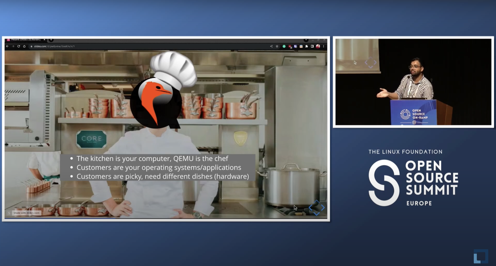  |
| Open Source Summit China 2023 | [Selected] | Talk got selected. Couldn't go due to visa issues. Maybe next year. |
| Linux Plumbers 2023 | [Selected] | THE Linux Kernel conference to attend in the world. 2023 was my first year stepping back into conferencing and another journey to United States to attend this would have stretched me a bit too far.  |
| Open Source Summit Japan 2023 [Let's Build Our Own Virtual RaspberryPi Using QEMU Virtualization](https://sched.co/1TzRx) | [Slides](https://slides.com/vipulgupta2048/cdcon-japan-2023/) [Certificate](https://www.credly.com/badges/2e9936ba-60b7-4255-baf3-21d2fe530f92/) | Presenting my session at CDCon Japan 2023, going deeper into the hardware in the loop testing implemented at balena by my team. Discussed architecture and implementation details of the project. Received a lot of feedback from 50+ CI experts attending. The conference agenda was very well formulated and the schedule was one of the rare ones where each talk brought in something interesting 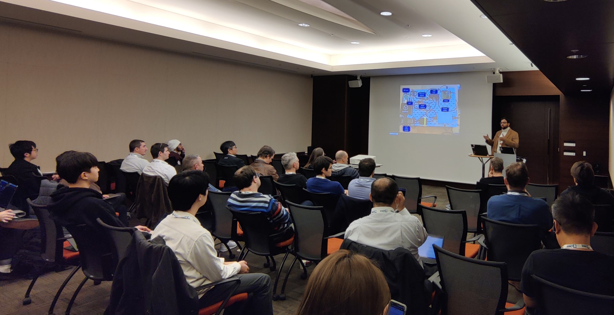 |

  
Sabbatical: Covid 2021-2022

  
  ### 2021-2022

  Nothing over here. 

  
2020

### 2020
| Title of the talk       | Link for Proposal  | Thoughts |
| --- |:---:|---|
| FOSSASIA Summit 2020 | Talk | [Selected] A topic I have been researching for quite some while. Couldn't go due to recent developments on Coronavirus |
| PyCon US: Pittsburgh 2020 | Talk | [Selected] Conference shifted to online mode. Lightning talk at the Education Summit. |
| Writing open-source documentation at scale that isn't terrible: Right the Docs | [Youtube Video](https://www.youtube.com/watch?v=ZW4NmuSi-pA), [Slides](https://slides.com/vipulgupta2048/writing-open-source-documentation-at-scale-that-isn-t-terrible/fullscreen), [Website](https://fossunited.org/hackathon) | [Delivered] Sharing insights into how folks can improve their project's or product's open-source documentation at scale at FOSS Hack 2020. My first talk out of many about docs after starting Mixster 2 years ago. |
| Documenting your next Python project: Right the Docs | Talk - [Slides](https://slides.com/vipulgupta2048/writing-open-source-documentation-at-scale-that-isn-t-terrible-879091/fullscreen) + [Proposal](https://github.com/pydelhi/talks/issues/191) | [Delivered] Documenting your next Python project is a deep dive into options available as far as internal tools are considered to document your Python code at the PyCon India Flames Meetup - Python mega meetup |
| Right the Docs: Mixster pitch | Lightning talk | [Delivered] Mixster's pitch at PyCon India 2020, for creating and most importantly fixing OSS documentation in the community. [Slides](https://slides.com/vipulgupta2048/deck/fullscreen) and Youtube coming soon |
| Hands On: Containerizing Python and Deploying to IoT and Edge Devices | Workshop - [Slides](https://docs.google.com/presentation/d/1Ve43SXu78fgePMfA--psofAUZ8YeRLwPtR0HPXNsDRw/edit?usp=sharing) and [PyCon Proposal](https://in.pycon.org/cfp/2020/proposals/hands-on-containerizing-python-and-deploying-to-iot-and-edge-devices~egJYk/) | [Delivered] In the world of IoT, python can be used for reading data from sensors, enabling Artificial Intelligence and Machine Learning at the edge. Developing all of this locally on small prototype devi is great, but when it comes to deploying devices out into the world, special considerations need to be taken. For that we present balenaCloud. |

  
2019

### 2019
| Title of the talk       | Link for Proposal  | Thoughts |
| --- |:---:|---|
| PyCon US: Cleveland, Ohio 2019 | [Proposal](https://us.pycon.org/2019/schedule/presentation/415/), [Tweet](https://twitter.com/vipulgupta2048/status/1096062549877899264) [Archive](./img/pycon-us/screenshot.png) | [Selected](https://us.pycon.org/2019/schedule/presentation/415/?fbclid=IwAR1c34BedXNB3mw7hG5_zbQxx001gGL6NFdVSXj6UDlk1xpFCeESDQXmcdo) Talk on Reinventing Education with Python in 2019 representing PyDelhi and Sugar Labs in the biggest Python conference in the world. |
| DebUtsav Delhi 2019 | [Proposal](https://2019.goa.debutsav.in/) | [Delivered](https://diasp.org/tags/debutsav) Talk on importance of digging opportunities in Open-Source, to attendees of DebUtsav at National Institute of Public Finance and Policy (NIFPP) [Slides](https://slides.com/vipulgupta2048/finding-foss) |
| PyCon Singapore 2019 | Lightning talk | [Delivered](https://pycon.sg/edu-summit/) Spreading awareness about Sugar Labs's aim to transforming pedagogy with Python, showcasing our work over the years, contributions and impact created to improve the overall education scenario at the Education Summit. In line with the Outreach efforts of Sugar Labs in the APAC region, and how it helps remodel the current education system with its free and open-source Python tools. [Screenshot](./img/2.png) |
| PyCon UK 2019, PyCon ZA 2019 | talks on Sugar Labs | [Accepted] Spreading awareness about Sugar Labs's aim to transforming pedagogy with Python, showcasing our work over the years, contributions and impact created. |
| Open Source Festival Lagos + Sustain Africa 2020 | Talk | [Selected] Forge your future with open-source: A primer for freelancers to grow with FOSS. With everyone looking for jobs, internships, or opportunities, I, a full-time student from the age of 18 have been leveraging open-source to find the right breaks, grow my community, and build my persona both personally & professionally. After this talk, you can do it too. |

  
2018

  
### 2018
| Title of the talk       | Link for Proposal  | Thoughts |
| --- |:---:|---|
| Plymouth 101: Bootloader's Frontend     | [Link for proposal](https://github.com/ILUGD/talks/issues/80)  | [Delivered] - ILUG-D - WeWork Meetup, [Slides](https://slides.com/vipulgupta2048/vplymouth) |
| Keeping your Dotfiles in check with Python     | [Link for proposal](https://in.pycon.org/cfp/2018/proposals/keeping-your-dotfiles-in-check-with-python~dw7Xd/)  | [Proposed] - PyCon India 2018 |
| Understanding GitHub Flow: Conquering Conflicts  | Spontaneous | [Delivered] [Repo Vanilla](https://github.com/vipulgupta2048/vanilla) used for tutorial : [Slides](https://sanyamkhurana.com/git-intro/) at PyDelhi Devsprints |
| DotFiles 101 and maintaining them with Python    | [Link for proposal](https://github.com/pydelhi/talks/issues/99)  | [Delivered] [Slides](https://slides.com/vipulgupta2048/dotpython-3/fullscreen)- PyDelhi Meetup @ Microsoft Corp, Gurugram : Check out the [BLOG](https://pydelhi.org/blog/pydelhi-meetup-08-july-2018.html) |
| Bot Creation BootCamp | [Link for proposal](https://github.com/linuxchixin/talks/issues/46) | [Delivered] [Slides](https://slides.com/vipulgupta2048/2itterbots/) SocialCops, Saket, New Delhi @ LinuxChix India Meetup - 2 September 2018 |
| How to contribute to Open-Source | Lightening talk | [Delivered] E2E Networks @ PyDelhi Meetup - 1 September 2018, [Blog Post for reference](https://pydelhi.org/blog/pydelhi-first-visit-e2enetworks.html) |
| Google Summer of Code - Headstart Session | Spontaneous | [Delivered] Invited for a talk about my experience with Google Summer of Code along with Ajay Garg and the coding blocks team at Amity University by IUCEE Club - Addressed about 80 Students based on my popular [blog](https://mixster.dev/2018/04/25/123gsoc/) |
| Green dots doesn't matter contributing does | [Proposal](https://github.com/MozillaFestival/mozfest-program-2018/issues/106) [Slides](https://docs.google.com/presentation/d/1HlBf3QgFz9sR00gmuB2LWEi7mLhyJ8qVOlT3gq_vcm0/edit?usp=sharing) | [Delivered] Mozfest 2018 - [Got a nice blog](https://mixster.dev/2018/11/20/mozfest2018/) Had a great talk at Mozfest, I even got featured in the newsletter. 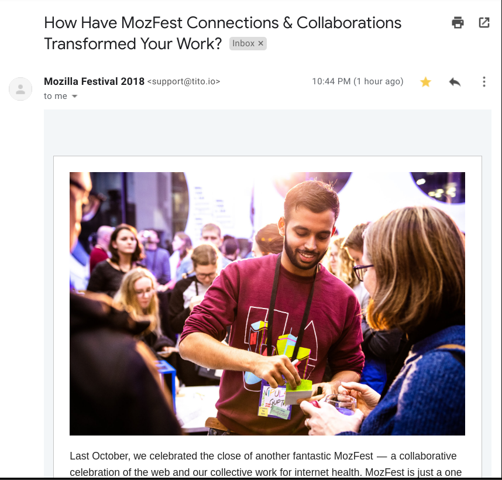 |
| FSoSS 2018 New York | [Proposal](https://imgur.com/a/ftfRFQ1) | [Couldn't go] Community Talks - Managing dotfiles with Homely |
| Sugar Port - My GSoC project with Sugar Labs |  Lightening talk | [Delivered] At Google London Office for a lightning talk on my Google Summer of Code project, Sugar Port. [Slides](https://docs.google.com/presentation/d/12B2vPtcm5OhNYSIVNCZqrU-HiA04X7LjDpdSFSWQAbI/edit?usp=sharing) |
| Mytrah talks 2018 | Selected among 100+ case studies at the National level [Video](https://photos.app.goo.gl/HHQ8C5MsS7MFsj8w7) !@! [Slides](https://docs.google.com/presentation/d/1wsHJvKbGeR-0jaTYETqjPx87VThNT3oz8RDxN45xblY/edit?usp=sharing) | [Delivered] At Amity University, in front of a diverse crowd of scientists, researchers, and students working on renewable energy and sustainable environment. |

  
2017

  
  ### 2017
  
  | Title of the talk       | Link for Proposal  | Thoughts |
  | --- |:---:|---|
  | Introduction to Git     | [Link for proposal](https://github.com/ILUGD/talks/issues/45) | [Delivered] [Repo Vanilla](https://github.com/vipulgupta2048/vanilla) used for tutorial.  |
  | CSE essentials     | [Link for proposal](https://github.com/asetalias/Logistics-and-Event-Contributions/issues/1)  | [Delivered] Basic content covered - IRC, Shell commands, git, mailing list guidelines, community guidelines; for juniors in Amity University |
| Fish: The terminal     | Flash Talks  | [Delivered] @ Women who Go meetup - IIIT-D - What is Fish, showing my configuration. How it's better and more productive. |
| Mentored Dev-Sprints for PyDelhi, Sugar Labs | No links  | [Delivered] Once a month at PyDelhi meetups, in which many organization mentors come together to contribute and solve issues  |

---

## Conferences with 2048

From attending, to volunteering, to organizing and networking in conferences. Whatever role I play in a conference. I add it here. Conferences are strange for me in their phenomena. Apart from all the travel, meeting people, preparing to take the stage there is a genuine fear of missing out for me. If I don't attend one, there is FOMO. But, the more you connect in one, the more FOMO you get. Whether that's the case for you. Few things are certain. Social batteries are bound to run out. Leg pain is mandatory. And, If you are attending every single session then probably rethink your approach and spend some time in the hallway. See you there!

| Conference       | Website/Link for event | Comments |
| --- |:---:|---|
| PyDelhi Conference 2017 | [Website](https://conference.pydelhi.org) | Attendee - My first tech conference |
| PyCon India 2017 | [Website](https://in.pycon.org/2017/) | Contributed to the Pycon India 2017 official website, wrote 10+ blogs, and volunteered onsite for the event. I re-designed sections of the website, fixed bugs, and wrote blog posts for the various sponsors and keynote speakers + GitHub links - https://goo.gl/EiPRN2 and https://goo.gl/acgrf9  |
| Confluence 2018 | [Website](https://www.amity.edu/aset/confluence2018/)| Speaker Committee - Assisted Ms. Marde Helbig from the University of Pretoria, South Africa - [Related blog post](https://mixster.dev/2018/01/20/confluence18-the-good-the-great/) |
| Google I/O Extended 2018 | [Website](https://www.meetup.com/GDGNewDelhi/events/250303488/) | Attendee - Session Proposed - Led a small discussion on Google Summer of Code |
| Google Cloud Summit 2018: Delhi | [Website] | Invited on behalf of Sugar Labs to participate and learn about Google Cloud Platform and meet fellow googlers |
| PyCon India 2018 | [Website](https://in.pycon.org/2018/) | Proposed Talk and Development Manager - Supervising, and reviewing all work and development regarding the Official PyCon India 2018 Website, Blog, Twitter bots, Social Media Outreach, Apps and more. |
| Mytrah Talks 2018 | [Website] | Presented Case Study at Mytrah Talks 2018 Noida in front of hundreds of panelists and experts of the sustainable development field, case Study won the first prize |
| Linux Foundation's Open Source Summit 2018 | [Website](https://events.linuxfoundation.org/events/open-source-summit-europe-2018/) | Awarded scholarship a travel stipend and full-access ticket to the conference worth 1000$ happening in Edinburgh, UK |
| Mozfest 2018 | [Website](https://mozillafestival.org/) | Facilitator and volunteer in the Youth Zone of the 8 track mega festival of Mozilla at Ravensbourne College, London, UK |
| Sustain Summit 2018 | [Website](https://sustainoss.org) |  Invited as a sustainer to represent Sugar Labs and ALiAS globally in between the biggest communities in the world including that of Google, Microsoft, StackOverflow, GitHub and more|
| Digital Ocean Tide 2018: New Delhi | [Website](https://www.meetup.com/DigitalOceanDelhi/events/256140664/) | Attended to explore opportunities with Digital Ocean, instead got opportunities with Hasura as SDE intern. So thrilled to join them in May 2019. |
| DebUtsav 2018 | Meetup | Attended this awesome mini-conf from 9-10 March 2019, to learn Debian packaging and participate in bug squashing party over the weekend at NIFPP, gave a small talk on digging opportunities as well |
| GraphQL Summit ASIA 2019 | [Website](https://www.graphql-asia.org) | Handled bit of Community Outreach |
| React India 2019 | [Website](https://reactindia.io) | One of the 10 React India Scholarship awardees to be accepted into the largest React conference in India by the React Community and Geekabyte. Held in Goa on 26-28 September 2019. |
| KubeCon Europe 2020 | [Website](https://events.linuxfoundation.org/kubecon-cloudnativecon-europe/) | Awarded the Diversity scholarship to attend KubeCon this year, due to my documentation contribution to Prometheus related projects and releasing AquaSec's KubeHunter for PyPi |
| PyCon India 2020, Online | [Website](https://in.pycon.org/2020/) | Content Workgroup lead for PyCon India Virtual Conf. Gave conf new direction with a [defined content pipeline](https://github.com/pythonindia/inpycon-blog/pulls?q=is%3Aclosed+is%3Apr+author%3A%40me+), documented processes for future years and created the [PyCon India Program Guide](https://in.pycon.org/blog/2020/announce-pycon-india-program-guide.html). |
| PyCon India 2021, Online | [Website](https://in.pycon.org/2020/) | Content & Social Media Workgroup lead for PyCon India Virtual Conf. [More of the same work](https://github.com/pythonindia/inpycon-blog/pulls?q=is%3Aclosed+is%3Apr+author%3A%40me+) but this time with broader responsibilities and making the [PyCon India Program Guide](https://in.pycon.org/share/PyConIndia2021ProgramGuide.pdf). |
| Sabbatical: Covid 2020-2021 | - | - |
|~ 2022 ~|||
| DelhiFOSS 1.0 2022 from FOSS United | [Website](https://indiafoss.net/delhi/2022/schedule) | Really good conference organized by the FOSS UNITED team in New Delhi. Gave a talk there, met a lot of good people there and one of my first offline conference after Covid. Good times. Will be applying for a lot more. |
|~ 2022 ~|||
| CDCon + gitOpsCon 2023 Vancouver | [Website](https://events.linuxfoundation.org/cdcon-gitopscon/) | A mini conference was executed well and I really got a chance to actually connect with all the sponsors. Met a lot of good people during and after my talk at the conference. One of my first offline conference abroad after Covid. Good times. Will continue applying. |
| Open Source Summit 2023 Vancouver | [Website](https://events.linuxfoundation.org/archive/2023/open-source-summit-north-america/) | Linux Foundation was gracious enough to provide passes to the premier open-source conference. The schedule was jam packed with different events and I was able to get a lot of feedback on my work, talks, general CFP process and making the most out of conferences themselves. I would say, coming out of it. I have a lot of respect for the developer advocates. |
| PyDelhi Conf 2023 | [Website](https://conference.pydelhi.org/) | After organizing PyDelhi meetups for 3 years, it was time for Delhi's biggest conference to return from the covid hiatus. Lots of sessions, people to meet and a talk to give. The two days at the conference went on quite well. |
| Open Source Summit 2023 Europe | [Website](https://events.linuxfoundation.org/archive/2023/open-source-summit-europe/) | The schedule was jam packed with different events and I was able to get a lot of feedback on my work, talks, general CFP process and making the most out of conferences themselves. I would say, coming out of it. I have a lot of respect for the developer advocates. Gave a session on QEMU. |
| PyCon India 2023 | [Website](https://in.pycon.org/2023/) | Back in Hyderabad to meet a lot of familiar faces at the 'ol stomping ground of Python's premier conference called PyCon India. Was a volunteer as usual helping make the conference yet another roaring success. |
| Open Source Summit 2023 Japan | [Website](https://events.linuxfoundation.org/archive/2023/open-source-summit-japan/) | The same brand of amazing, schedule packed open-source conference but thankfully in the same continent. First time visiting Tokyo to attend the mega conference was an amazing experience. One that I would gladly repeat anytime. Gave a talk at the conference and met a lot of people. |
|~ 2024 ~|||
| DelhiFOSS 2.0 2024 | [Website](https://indiafoss.net/delhi/2024/schedule) | An open-source focused conference organized by the FOSS United Delhi Chapter. Gave a talk, met a lot of new people in my city and the first conference of 2024. The event was held at Indian Institue of Technology, New Delhi. First time being there, and good times. |
| GitHub Constellation 2024 | [Website](https://githubconstellation.com/) | Constellation 2024 is GitHub's in-person developer conference celebrating the best of the Indian developer community. One day event to learn, share and connect with developers on topics like  AI,  Collaboration,  Community and  Security held in Bangalore, India. First time being there, first time speaking at GH conference and good times. |

***

## Hackathons with 2048

| Hackathons      | Links | Comments |
| --- |:---:|---|
| HackIIIT 2018 | [Project Deck](https://slides.com/vipulgupta2048/stacksfx) | 3rd Prize and best woman participant - Made the emotion-based Music Player, called StacksFX by team StacksFX, [blog post for reference](https://mixster.dev/2018/08/20/stacksfx-at-hackiiit-my-1-hackathon/) |
| HackMIT 2018 | [Website](https://hackmit.org) | Project Wats'on The Roof selected for IBM: Call for Code - Global Challenge [blog post for reference](https://mixster.dev/2018/09/28/hackmit-2018/) |
| Hack Moscow 2018 | [Website](https://hack.moscow/) | Selected as a Lonewolf |
| MSHack 2018 | [Website](https://mshack.devpost.com) | Team of 4, StacksFX was selected out of 2000 team submission in the online round, to hack at Microsoft Gurugram to create [InsightsFX](https://devpost.com/software/insightsfx), a unique air pollution management solution with insights that help make everyday life easier |
| Smart India Hackathon 2019 | [Website](https://www.sih.gov.in) | Participated in the World's biggest hackathon on problem statement of Environment Engineering solving problems that benefit our entire community. Inspired over 50 teams from ALiAS to participate with their innovative statements. Facilitated 2 teams with reimbursements for their travel which cleared the national rounds. Go ALiAS! |
| PenApps 2019 | [Website](https://pennapps.com) | Selected with my team StacksFX |
| FOSS Hack 2020 | [Website](https://fossunited.org/hackathon) | Mentor for hardware projects at FOSS Hack 2020 and Speaker. This was an online 48-hour hackathon with a great talks agenda and an equally well-organized team. It was quite fun to see about 150+ FOSS projects getting out there.  |
| HackBMU 2020 | [Website](https://hackbmu-3.devfolio.co/) | Judged the 3rd Iteration of HackBMU at BML Munjal College. Was my first time as a judge and a fitting end to an era of participating at hackathons as a student 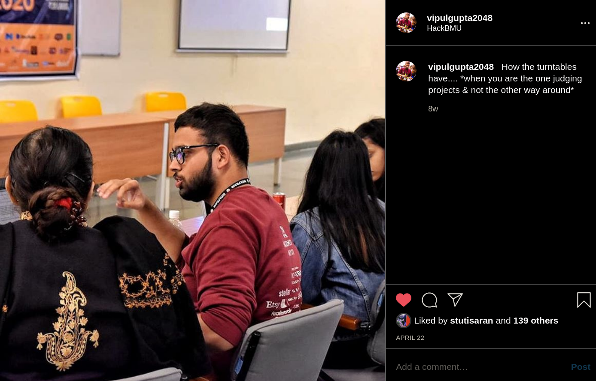 |
| Sabbatical: Covid 2020-2021 | - | - |
|~ 2024 ~|||
| Testbutler wins [GitLab Pitch Competition](https://gitlab.devpost.com) 🔥🔥 | [WINNER, 4th prize!](https://devpost.com/software/testbutler-iot-testing-made-easier) | Held during January '2024. The hackathon was a chance to build a proof of concept and a pitch to improve services on GitLab's platform. I pitched TestButler as a new pipeline for GitLab customers to test their code directly on their devices using GitLab Runners and Balena. Won $3k cash prize for my project. 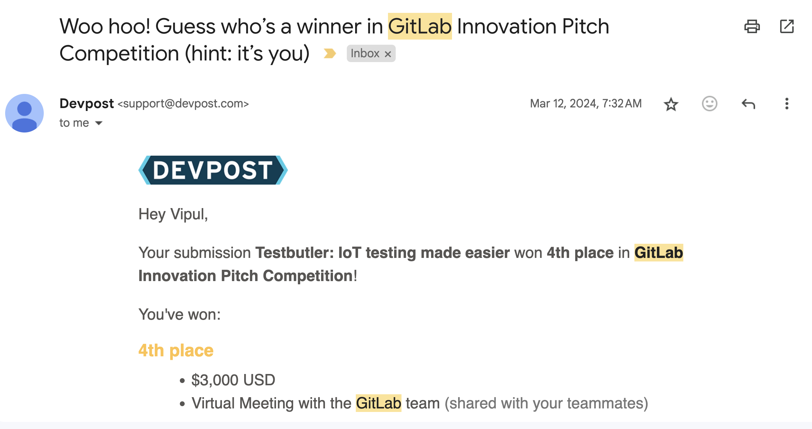 |

---

## Mixster by 2048 (Top 10 blogs of all-time)

Mixster is where I document my life, my travels and my work. Mixster is also where I work

1. [4 Months Of Full-time Remote: Hits, Misses, and Infectious Initiative](https://mixster.dev/2020/08/23/four-months-remote-2020/)
2. [Hackmit 2018: a Journey Through My Lens](https://mixster.dev/2018/09/28/hackmit-2018/)
3. [How to Be Financially Independent Before College Without Getting Lucky‽‽](https://mixster.dev/2020/04/16/how-to-be-financially-independent-before-college/)
4. [Humans of Mixster](https://mixster.dev/humans-of-mixster/)
5. [Taking Names, Giving Hugs: Acknowledge-II-mentation](https://mixster.dev/2020/03/19/thankyou2020/)
6. [(Simple English) What is Kubernetes (K8’s), “the Office” Version](https://mixster.dev/2020/01/07/what-is-kubernetes-k8s-simple-english/)
7. [‘n’ Honest Truths About Working Remote (Community Edition)](https://mixster.dev/2019/07/19/n-honest-truths-about-working-remote-community-edition/)
8. [“BRUH, SLOW DOWN…”](https://mixster.dev/2018/04/30/bruh-slow-down/)
9. 
10. I will leave this one empty for you all to decide on the 10th!

I also released a newsletter, [Mixster x Mixtapes](https://buttondown.email/vipulgupta2048).

## Google Summer of Code with 2048
---
slug: /gsoc
---

| Project  | Project org | Proposal Links | Work Product | Status/LoC |
| --- | --- | --- | --- | --- |
| [Integrate Cerberus in Spidermon](https://summerofcode.withgoogle.com/archive/2019/projects/5471827642548224/) | The Scrapy Project (GSoC 2019) | [Project Proposal #1](https://docs.google.com/document/d/14iLYsnZYpxR-YvbceB6VljyCBwCFsPk4f-iaoPGAUZY/edit?usp=sharing) & [Project Proposal #2](https://docs.google.com/document/d/1FGd1te3A07PDIcQheBDparclUemU1CE_ixngHTVvQzs/edit?usp=sharing) | [Final Implementation](https://github.com/scrapinghub/spidermon/pull/201) and [Work Report](https://mixster.dev/2019/08/24/integrate-cerberus-work-report/)| **Completed** :heavy_check_mark: [Letter of Completion](./docs/img/gsoc/GSoC-2019-Certificate-for-Vipul-Gupta.pdf) & [Completion Certificate](./docs/img/gsoc/GSoC-2019-Completion-Verification-Letter-for-Vipul-Gupta-(1).pdf) |
| [Setting up of Activity Server and WikiPort (Activity Migration)](https://summerofcode.withgoogle.com/archive/2018/projects/4997424095428608/) | Sugar Labs (GSoC 2018) | [Project Proposal](https://docs.google.com/document/d/1mPd_SeUqeJF_yKWVEDFuzU7LWsnUFSbLdQQ44HvsYyA/edit?usp=sharing) | [**Work Product**](https://github.com/vipulgupta2048/sugarport) | **Completed** :heavy_check_mark: [Letter of Completion](./docs/img/gsoc/GSoC-2018-Completion-Verification-Letter-for-Vipul-Gupta.pdf) & [Completion Certificate](./docs/img/gsoc/GSoC-2018-Certificate-of-Completion-for-Vipul-Gupta.pdf) |

From the start, I had the pleasure of contributing and participating in Google Summer of Code with [Sugar Labs in 2018](https://github.com/vipulgupta2048/mygsoc) and again a year later with [The Scrapy Project in 2019](https://github.com/vipulgupta2048/mygsoc). Executing these projects and working with the organizations taught me a lot. Even after the projects have finished, I continued to volunteer with Sugar Labs focusing on Outreach efforts and playing an active part in their Google OSS programs. I contribute code frequently to ScrapingHub and The Scrapy Project. These were good times indeed.

 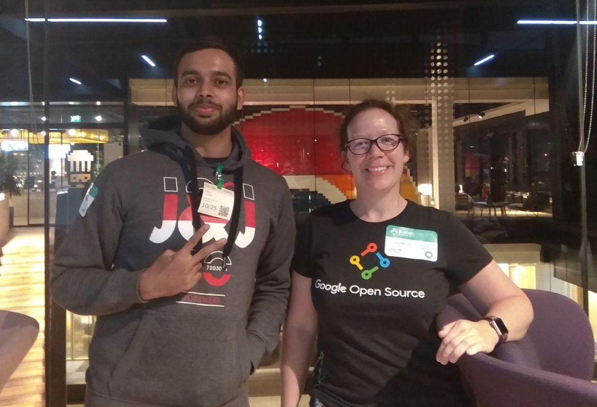
 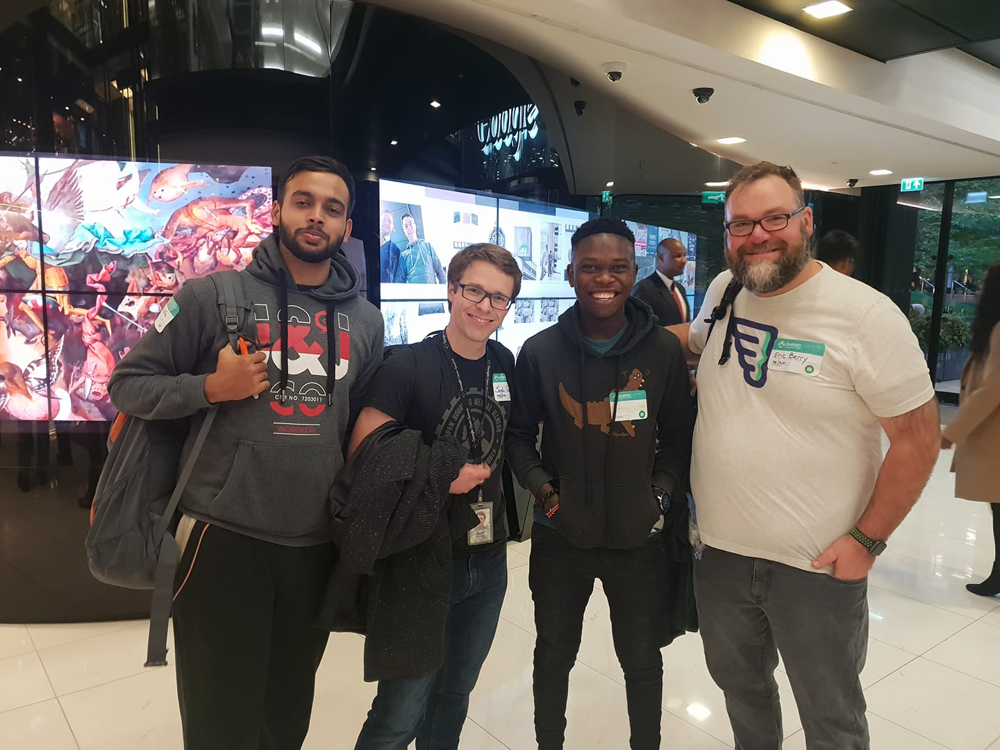

**Blogs, Podcasts & Guides**

If you like to read more, I can recommend.

- The premier blog on Getting Started with GSoC. [One, Two, Three, ... GSoC!!](https://mixster.dev/2018/04/25/123gsoc/)
- [Transcending Limitations and Fulfilling Goals as a GSoC Student](https://dev.to/vipulgupta2048/transcending-limitations-and-fulfilling-goals-as-a-gsoc-student-4jcb)
- [Join the GSoC AMA Program](https://mixster.dev/2019/06/01/aliasama/) that I ran at ALiAS. We taught best practices for open-source and contributing with the right ethics.
-  With mentoring, help and several sessions 18 students got the chance next year to participate in GSoC from my college where there was next to none in terms of open-source culture. One of my proudest achievements.
- Writing for PSF's Official Blog
- [Mixster #GSoC](https://mixster.dev/gsoc/) - Read about the 12 week journey that I undertook in 2018 and 2019.
- [Talking Gsoc and open source w/ Vipul and Prakhar - DeCompiled Podcast](https://www.youtube.com/watch?v=CFAT_X84zJM)
- [#0 ALiAS does it Again: Report on our GSoC AMA Program](https://asetalias.in/blog/post/aliasama/)

## Mentoring with 2048

| Program  | Organization | Status/LoC |
| --- | --- | --- |
| Mentoring contributors at my Alma Mater | [ALiAS](https://asetalias.in) | My proudest achievement has been founding an independent, open-source college community with my peers. Few students in a classroom peer learning git and GitHub kickstarted the open-source culture at my Alma mater that grew into hundreds of students across campuses learning to contribute to FOSS. The community decayed at one point but never died. It's flourishing with folks self-organizing internships, summer of code programs, hackathons and conferences. It's free, open for all and has no hierarchal governance model. Student volunteers run events every week with support from seniors (us) who provide mentorship, opportunities and guidance that we never received. I started the [ALiAS AMA](https://mixster.dev/2019/06/01/aliasama/), and [Abroad Opportunities Fund Scholarship](https://amity.edu/admissions-scholarship.aspx) to help students get access to every opportunity they want to reach out for.  | 
| [Google Code In 2019](https://codein.withgoogle.com/archive/2019/organization/5148169659219968/) | Sugar Labs | [Certificate](./docs/img/gsoc/GCI-2019-Certificate-5509470436720640.pdf) Google Code-in was a contest that introduced pre-university students (ages 13-17) to open source software development. I participated mentoring students to accomplish a total of 178 tasks alloted by the organization. | 
| [OpenEBS Hackfest](https://mixster.dev/2018/05/26/writing-documentation-hacking-with-go-for-openebs-foss/) | OpenEBS | OpenEBS Hackfest is a 3-month long open-source contribution festival. Awarded star contributor for major contributions to documentation & its pipelines. [Contributions](https://github.com/search?utf8=%E2%9C%93&q=org:openebs+is:pr++label:summerhack++author:vipulgupta2048+is:merged&type=Issues), [Star Contributor](https://twitter.com/vipulgupta2048/status/1018540819911987200), [prizes](https://twitter.com/openebs/status/1002182541745385473?s=20) |
| [Google Code In 2018](https://codein.withgoogle.com/archive/2018/organization/5131432846426112/) | Sugar Labs | [Certificate](./docs/img/gsoc/GCI-2018-Certificate-for-Vipul-Gupta.pdf) Google Code-in was a contest that introduced pre-university students (ages 13-17) to open source software development. I participated mentoring students to accomplish a total of 135 tasks alloted by the organization.  |
| Peer Mentor | 1 Million Women to Tech x Girlscript Summer of Code  | Mentored Women in 1 Million Woman to Tech Python track in the summer'18 to help them kickstart their careers in tech and help them fulfill their true aspirations by utilizing their full potential. Mentored the project WTF Python in GirlScript Summer of Code for the GirlScript foundation for 3+ months to help people contribute to the open-source project, WTF Python. |

## Projects with 2048

Who knew? I love working on product design so much. It all started with this take-home assignment, I received from a PM interview. Now, I work on product design creating wireframes on AdobeXD whenever I feel like it. It feels liberating to let my ideas flow on a 770x340Px artboard with nothing but me and my prototypes.

| Products  | Project Link | Comments |
| --- |:---:|---|
|| [Behance](https://www.behance.net/gallery/86486979/The-BookHustler-Project) | The BookHustler Project was my first project. It's an e-commerce app for buying, selling, and renting second-hand books online. I have [documented the idea](https://docs.google.com/document/d/1Ppgt6Pk2n0Mdp2YpBTtIym8Nx4ugAlAz92r067DDsEU/edit?usp=sharing) as well behind the project if you like to read. It has all the information from the logistics of how books are bought and sold to the renting model involved. [Adobe XD Project file](https://drive.google.com/uc?export=download&id=1z-wf3OHqc2CAsAOl8eHVXJsBojeRp8d8) |
|  | [GitHub](https://github.com/vipulgupta2048/meetbot) | Meetbot is a Google Meet bot that makes your meetings frictionless. It records chat transcript and voice captions, validates user audio and auto-records meetings which it can join automatically from a given calendar. |
| 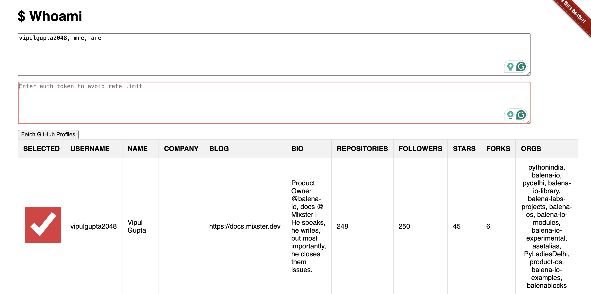 | [GitHub](https://github.com/vipulgupta2048/whoami) | Whoami is a essential tool in parsing & finding information about GitHub users. The data is fetched from GitHub API by providing a comma seperated list of usernames. |

---

## Organizing with 2048

After being an organizer for many years to a number of communities, I have thought of starting my own meetups. I take huge pride in striking that spark that is conversations between strangers, building relationships more than piling up connections and helping my people succeed. Good vibes guaranteed is what I bring to a conference/meetup. Here's what I have worked on in the past.

| Meetups/Conferences | Link | Years  | Comments |
| --- | --- | --- | --- |
| Github GitTogether Meetups | [Meetup](https://www.meetup.com/gittogether-delhi/?eventOrigin=event_home_page) | 2024 - present  | Organizer for GitTogether Delhi NCR is a gathering for developers in and around Delhi, India. Powered by GitHub and led by community experts, the events cover diverse topics such as AI, Open Source, and Security. |
| PyCon India | [Website](https://in.pycon.org) | 2018 - present  | PyCon India 2023 is the premier conference for Python enthusiasts and professionals, offering an unparalleled opportunity to dive deep into the world of Python and explore its limitless potential. Worn multiple hats at the conference   |
| Monthly City Meetups | [Posts on Twitter](https://twitter.com/vipulgupta2048/status/1547295294395928576?s=20&t=Az4ux_k_zudpqE7OA3MCGA) | 2021 - present | I organize mini meetups with folks in and around the city who like to come out and meet people on Saturday. |
| RemoteIndian Delhi Meetup | [Meetup](https://lu.ma/delhiremote) | 2022 - present  | I organize mini meetups with folks in and around the city who like to come out and meet people on Saturday. |
| PyDelhi Meetup | [Meetup](https://meetup.com/pydelhi) | 2017-2020 | Actively volunteered as co-organizer for 3 years till Covid came and my social battery got depleted through Zoom meetups. During my time, we organized meetups every fortnight for 2 years straight with several collaborations, workshops, talks, devsprints and fun hackathons in the middle. The community grew to 11k members but don't have the bandwidth remaining to be co-organizer again. |
| Indian Linux users Group Delhi meetup | [Meetup](https://meetup.com/ilugdelhi) | 2017-2020 | Volunteered for the meetups for a couple of years. |

---

## Podcasts with 2048

> Tune into the podcasts I've been a part of, discussing everything from remote work to the intricacies of open-source culture.

| Podcasts  | Links | Comments |
| --- |:---:|---|
| [How to get a Remote Job as a fresher with RemoteIndian](https://remoteindian.com/videos) | [Link to the episode](https://share.descript.com/view/25c3e54f-48bb-4dea-9b5d-78acfe0d1d88) | Podcast with RemoteIndian having an amazing discussion discussing the importance of open-source, challenges of a junior dev and red flags in the application process. I hope this helps folks going forward. |
| [Sustain Our Software Podcast](https://podcast.sustainoss.org/episodes) with Vipul Gupta | [Link to the episode](https://podcast.sustainoss.org/4) | Samson Goddy and Vipul Gupta join the panelists' Pia Mancini and Richard Littauer to talk about open source activities in Nigeria and India. Vipul is the Global Outreach Team Lead at Sugar Labs. Sugar Labs is an activity-focused open-source software learning platform for children. Both Samson and Vipul agree that a lot of developers they talk to are not very familiar with open source and the most common question they receive in meet-up groups is how one can start to contribute to open source. |
| [Decompiled](https://codensolder.com/decompiled): Google Summer of Code Edition | [Link to the episode](https://www.youtube.com/watch?v=CFAT_X84zJM) | Was invited for a fun insightful episode with the host Ayan Pahwa and Prakhar Srivastava on Decompiled to talk about Sugar Labs, Open-Source, and Google Summer of Code. Episode out now, check it out [here](https://www.youtube.com/watch?v=CFAT_X84zJM). |
| [CodeCast Zambia](https://twitter.com/codecastzm) Open-Source, Freelancing, and Financial Independence by Vipul Gupta | [Link to the episode](https://open.spotify.com/episode/6gvXFnMUTDx6ceUUrGR03M?si=ad9NZrMSTSScdSlUhQL_CQ) | Daniel talks to Vipul about alternative sources of income and the stigma behind freelance work as well as tips to freelancing effectively and using open source contributions to up-skill yourself. |

---

## Designing sometimes with 2048

> Take a peek at my design attempts, where I center align inspiration, rotate prespectives to create visually appealing "stuff".

<table>
  <tbody>
  <tr>
      <td align="center" width="33%">
         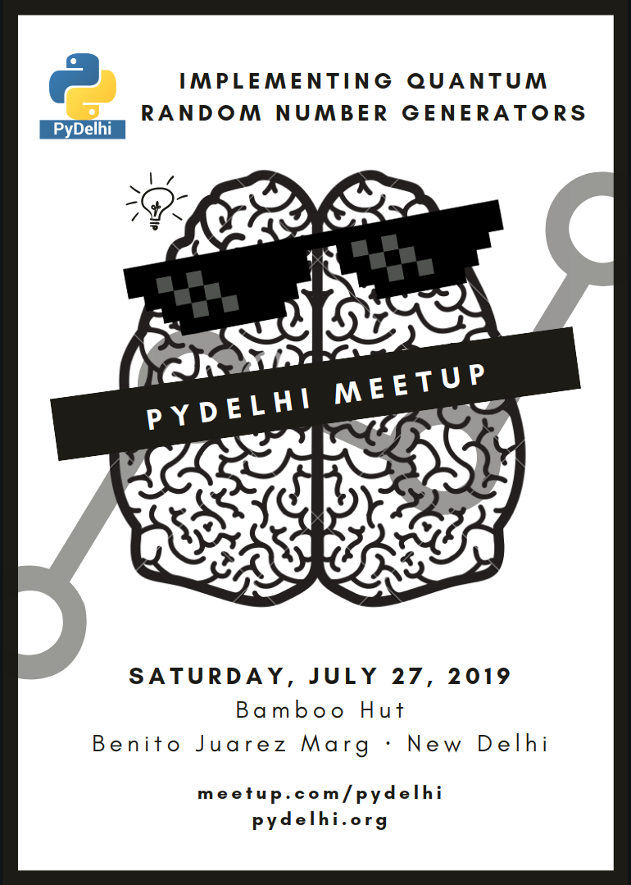
<a href="https://www.meetup.com/pydelhi/events/263185692/">[Meetup]</a> about Quantum random number generators by making the brain attaining thug life in this b/w poster.

      </td>
      <td align="center" width="33%">
        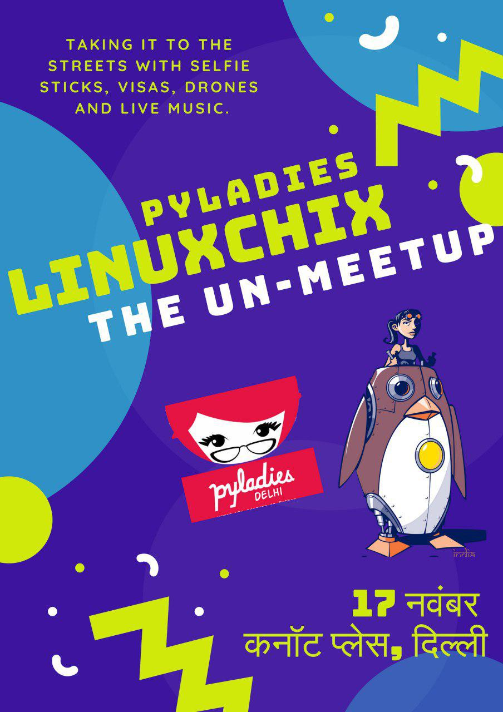
[UnMeetup] Loved this poster, just because of the bright palette of colors and fusion of Hindi &amp; English giving a modern, funky look!.

      </td>
      <td align="center" width="33%">
        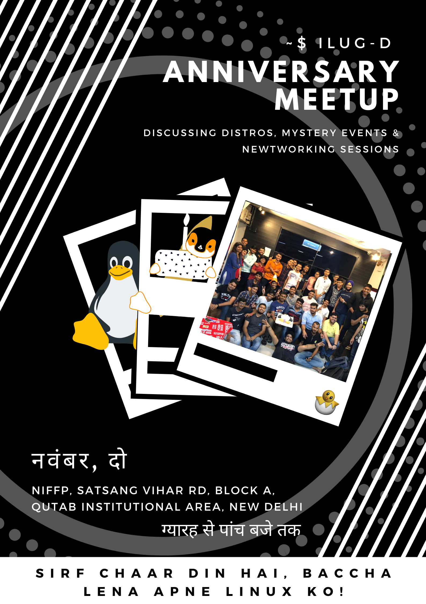
<a href="https://www.meetup.com/ilugdelhi/events/jkbtdqyznbqb/">[Meetup]</a>Took a wanted poster, used Digital Ocean's wallpapers and Linux terminal as a treasure hunt advert for ILuGD's Anniversary meetup.

      </td>
    </tr>
    <tr>
      <td align="center">
        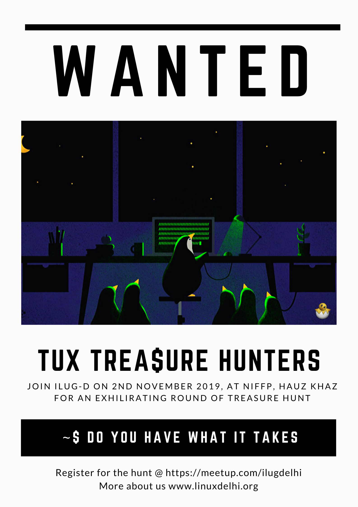
<a href="https://www.meetup.com/ilugdelhi/events/jkbtdqyznbqb/">[Meetup]</a> Had tons of fun designing this black beauty using Canva Pro, picked a fashion design template, added polaroid and glimmer circle. Used Hindi to re-introduce the funk back into design.

      </td>
      <td align="center">
        <a href="https://mixster.dev/2019/11/16/insync-onedrive-client-for-linux/">[Blog]</a>
A sweet &amp; simple poster designed for a sponsor on their new OneDrive Linux client release blog.

      </td>
      <td align="center">
        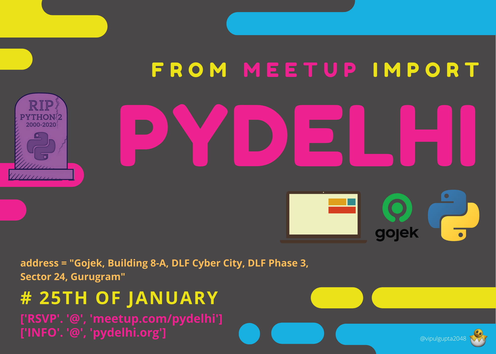
<a href="https://www.meetup.com/pydelhi/events/267949805/">[Meetup]</a> Saw this poster design, tweaked color palette and fonts to represent Python syntax with highlighting, originally for 9th Anniversary of PyDelhi.

      </td>
    </tr>
    <tr>
      <td align="center">
        
Sticker design from the awesome <a href="https://www.stickermule.com/en-in/unlock?ref_id=0751801701&utm_medium=link&utm_source=invite">StickerMule Design</a> Team.

      </td>
      <td align="center">
        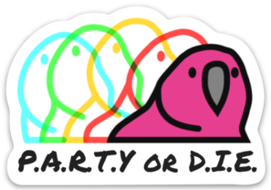
Sticker design from the awesome <a href="https://www.stickermule.com/en-in/unlock?ref_id=0751801701&utm_medium=link&utm_source=invite">StickerMule Design</a> Team.

      </td>
      <td align="center">
        
Sticker design from the awesome <a href="https://www.stickermule.com/en-in/unlock?ref_id=0751801701&utm_medium=link&utm_source=invite">StickerMule Design</a> Team.

      </td>
    </tr>
  </tbody>
</table>

---

## Credits

I always had an idea to build a docs as portfolio website since I love docs so much but the inspiration on Docusaurus showcase definitely helped. That's where I found [kosiec.dev](https://kosiec.dev/)'s clean, minimalistic site welcome page which I really liked. 
