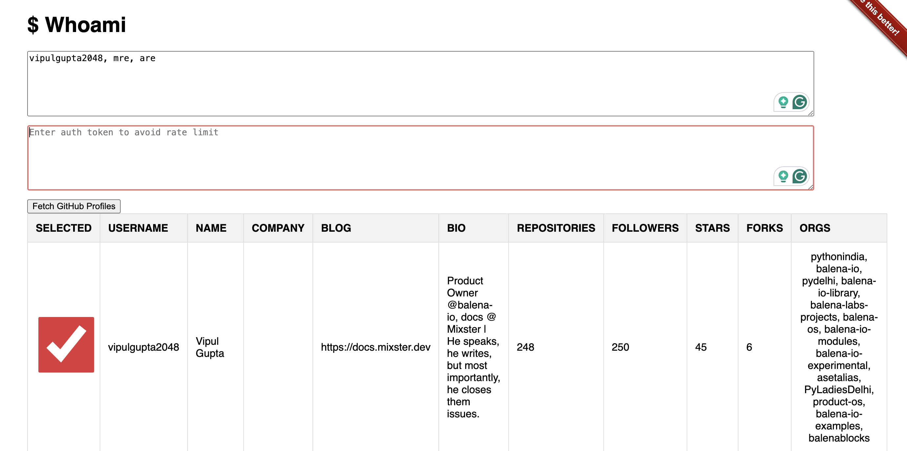

It all started with a take-home assignment in an interview. Creating wireframes on AdobeXD (now Figma), designing UX focused interfaces and writing READMEs for finished projects felt good. Look through my prototypes and what I keep on building. 

| Products  | Project Link | Comments |
| --- |:---:|---|
| | Work in Progress | Powerpoint Downsizer - Couldn't find anything that could optimize my PPT's when they go beyond 500Mb |
| | [GitHub Repo](https://github.com/vipulgupta2048/awesome-google-cloud-architect) | Passed Google Cloud Architect Professional Certification - Notes available here |
|  | [GitHub Repository](https://github.com/vipulgupta2048/dockerhub-bulk-archive) | A powerful automation tool built with Playwright to bulk archive multiple Docker Hub repositories. Perfect for cleaning up old repositories or managing large Docker Hub organizations. Archived 3000+ repositories for the [balena base images](https://blog.balena.io/deprecate-balenalib-images/). |
|  | Stealth | AI Docs Reviewer is an intelligent documentation review tool that leverages LLM as a judge technique to analyze, critique, and suggest improvements for technical documentation with code and technical docs as existing context. The tool aims to continously improve documentation quality by providing automated reviews on clarity, completeness, structure, and technical accuracy. |
|  | [Live Demo](https://docusaurus-builder.pages.dev/) | DocuBuilder is a scalable Docusaurus deployment solution built for Balena that automates the creation and deployment of 30+ Docusaurus websites on Cloudflare Pages, saving $18K USD annually in static site hosting costs. Features include zero-configuration setup, automated CI/CD integration, Docker-based local development, intelligent content inference from repositories, and preview deployments for pull requests. Was built to replace expensive hosting solutions while maintaining enterprise-grade reliability and developer experience to do what developers won't do, actually write docs. |
|  | [GitHub](https://github.com/vipulgupta2048/talkswith2048) [Live Demo](https://docs.mixster.dev) | TalksWith2048 is a comprehensive portfolio and professional documentation platform built with Docusaurus. This project serves as a centralized hub showcasing talks, conferences, workshops, mentoring experiences, and projects. Features include SEO-optimized markdown documentation, automated build workflows, responsive design, and structured content management. The technical implementation demonstrates modern static site generation, CI/CD integration, content optimization strategies, and professional portfolio architecture. Built to scale and maintain a growing collection of professional achievements and community contributions. |
|  | [GitHub](https://github.com/vipulgupta2048/gittogether-dashboard) [Live Demo](https://docs.mixster.dev/gittogether-dashboard) | GitTogether Delhi Community Dashboard is a Next.js application that visualizes the incredible growth journey of the GitTogether Delhi developer community from 0 to 4,986+ members in just one year. Features include interactive growth charts, event timelines, organizer profiles, photo galleries, and a presentation mode. Built with TypeScript, Tailwind CSS, and Framer Motion, it showcases modern React patterns and demonstrates community impact through data visualization. The dashboard highlights 11+ events with 1,400+ attendees, maintaining a 4.7/5 rating. |
|  | [GitHub](https://github.com/vipulgupta2048/meetbot) | Meetbot is a Google Meet bot that makes your meetings frictionless. It records chat transcript and voice captions, validates user audio and auto-records meetings which it can join automatically from a given calendar. |
|  | [GitHub](https://github.com/vipulgupta2048/whoami) | Whoami is a essential tool in parsing & finding information about GitHub users. The data is fetched from GitHub API by providing a comma seperated list of usernames. |
|  | [GitHub](https://github.com/vipulgupta2048/dockerhub-bulk-archive) | DockerHub Mass Archive Tool is a powerful automation tool built with Playwright to bulk archive multiple Docker Hub repositories. Features secure login with 2FA support, configurable repository lists, detailed progress tracking, and robust error handling. Perfect for cleaning up old repositories or managing large Docker Hub organizations. |
|| [Behance](https://www.behance.net/gallery/86486979/The-BookHustler-Project) | The BookHustler Project was my first project. It's an e-commerce app for buying, selling, and renting second-hand books online. I have [documented the idea](https://docs.google.com/document/d/1Ppgt6Pk2n0Mdp2YpBTtIym8Nx4ugAlAz92r067DDsEU/edit?usp=sharing) as well behind the project if you like to read. It has all the information from the logistics of how books are bought and sold to the renting model involved. [Adobe XD Project file](https://drive.google.com/uc?export=download&id=1z-wf3OHqc2CAsAOl8eHVXJsBojeRp8d8) |

