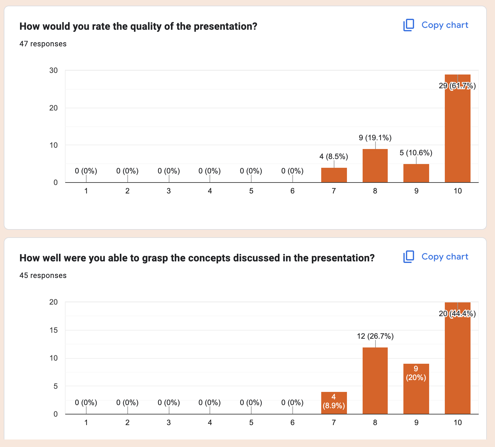
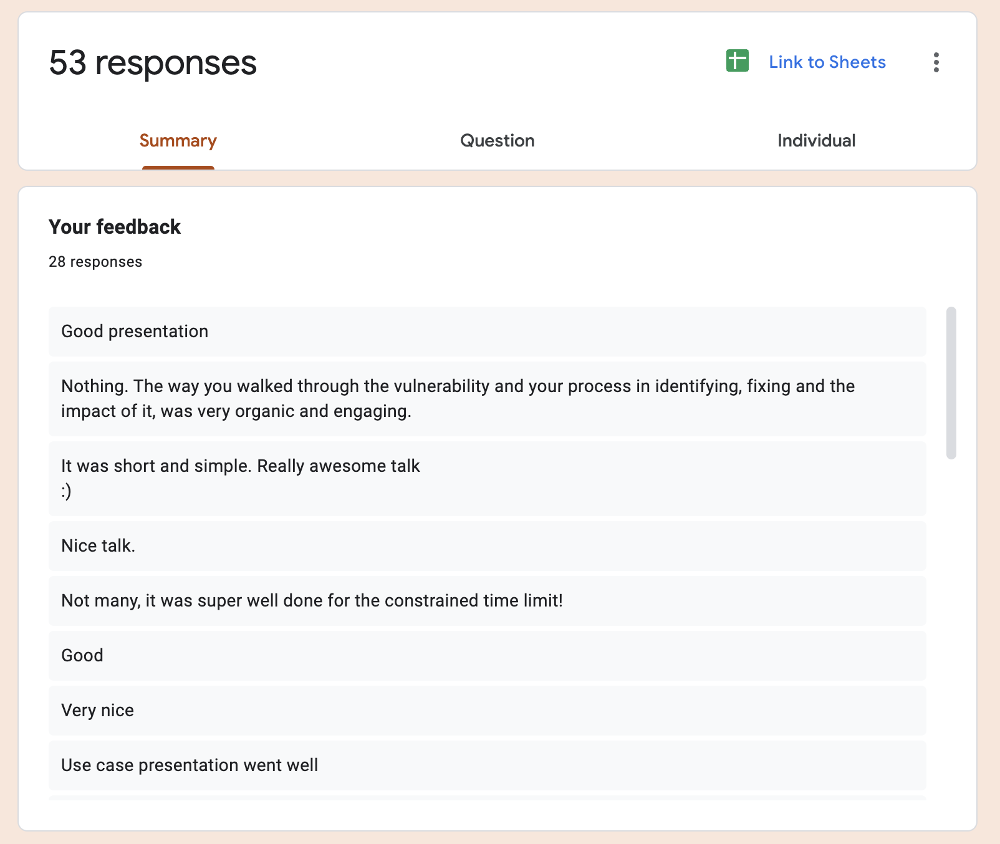
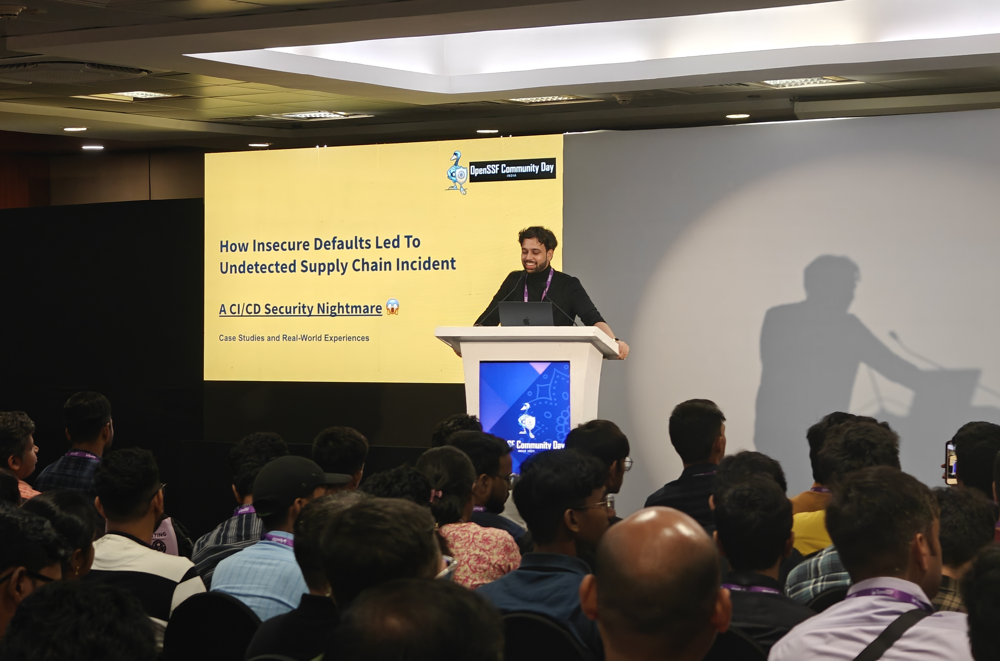
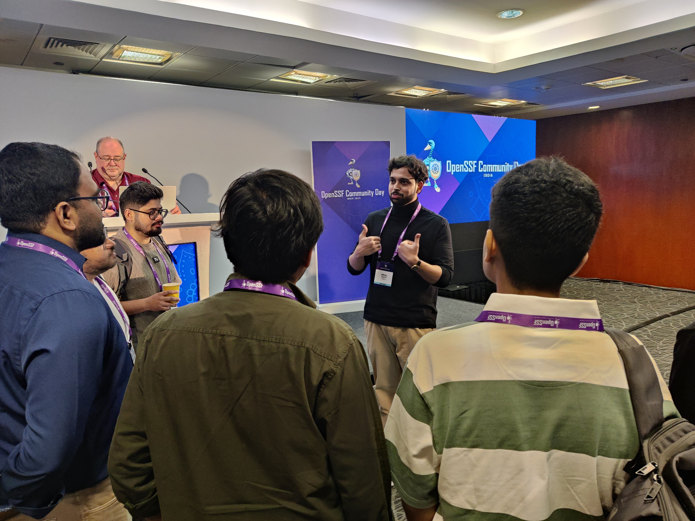

From local meetups to global conferences, I've aimed to weave technical concepts into unconventional, witty narratives. I believe deeply in the impact of a good story. Through my talks, I strive to not just inform but to connect, making each concept relatable and each session memorable. I still have a lot to learn, and you can find me collecting feedback from the audience after the talk. I intend to bring my unique brand of fun into each session I propose. No repeats, no boring monologue, if I can help it - Just a good, fun story. Served on a stage near you. Next time, please pull me in for feedback that you can provide.

## Stats 

- **Years of Experience:** 8+ years since 2017
- **Total Sessions:** 100+ online/offline 
- **Audience Reach:** 100,000+ senior engineers, early-career devs, and engineering students.
- **Geographic Reach:** 15+ countries, US, Canada, Japan, India, Spain, China, and more.

  
2025

## 🔒 Open Source Summit India 2025: OpenSSF India Community Days

### Supply Chain Security: How Insecure Defaults Led to Undetected Incidents

• 🔗 [Talk Link](https://openssfcdin2025.sched.com/event/242lj/how-insecure-defaults-led-to-undetected-supply-chain-incident-a-cicd-security-nightmare-vipul-gupta-balena?iframe=yes&w=100%&sidebar=yes&bg=no)  
• 📊 [Slides](https://docs.google.com/presentation/d/1yc8o9vu7NbWIrW2VfH1VRIsn80hjDH58PLKUqjZf0MI/edit?usp=sharing)  
• 🎥 Recording - Coming Soon  
• Hyderabad, India, 250+ Security Engineers & DevOps Professionals

A deep dive into how a misconfigured GitHub Action exposed a long-lived token for two years, creating an undetected attack vector that compromised a multi-platform code signing infrastructure. This session demonstrated real-world supply chain vulnerabilities and their mitigation strategies.

Received Feedback from 50+ Attendees

| | | 
|:---:|:---:|
|  |  |
|  |  |

---

## 🎓 Amity University Alumni Panel

### Technical Interview & Placement Preparation Workshop

• 📝 [LinkedIn Post](https://www.linkedin.com/posts/corporate-resource-centre-amity-school-of-engineering-and-technology-noida-876a33273_alumnitalk-thankyoualumni-engineering-ugcPost-7356989318604754944-RpyG?utm_source=share&utm_medium=member_desktop&rcm=ACoAACD76ywBmaTacRmcewhE1c2v2s8L8FVxT4k)  
• 📍 400+ Final Year Students at Amity School of Engineering & Technology, Noida 

Part of an expert alumni panel focused on practical strategies for technical interview preparation and industry placement success. Shared real-world insights on transitioning from academic pursuits to professional development roles through open-source and navigating the tech job market.

---

## 🤖 GitTogether Anniversary Meetup  
### AI Evaluation: Good LLM! Bad LLM? A Practical Guide to AI Evals

• 📊 [Slides](https://slides.com/vipulgupta2048/llm-ai-evals-vipulgupta2048)  
• 📍 Microsoft Gurgaon, 200+ tech professionals

Delivered an in-depth technical workshop on Large Language Model evaluation methodologies. Demonstrated systematic approaches to AI evaluation beyond traditional testing, including building an LLM-as-a-judge system live during the presentation.

Participants gained practical experience with modern AI assessment techniques and how to run LLM evaluations in production systems.

| | |
|:---:|:---:|
|  |  |

---

## 🔐 Internet Freedom Foundation x FOSS United Delhi
### Decoding The AI Black Box: An Engineer's Guide to LLM Evaluation

• 🔗 [Conference Page](https://fossunited.org/c/delhi/2025-june/cfp/ab8r4dbmm6)  
• 📊 [Slides](https://slides.com/vipulgupta2048/llm-ai-evals-vipulgupta2048)  
• 📸 [Session Feedback](./img/fossindia/talk-feedback-1.png)  

Presented my first session on LLM evals at the Interenet Freedom Foundation. Attendees took an in-depth dive into understanding AI evals, how it's fundamentally different from testing/benchmarking, impact on LLM pipeline, systematic ways to evaluate applications, types of evals and how to become an evaluator.

---

## 🎓 IIMT University GDG on Campus Workshop
### GitTogether: Git & GitHub Fundamentals for Developers

• 🔗 [Workshop Slides](https://github.com/vipulgupta2048/git-intro)  
• 📝 [Event Post](https://www.linkedin.com/feed/update/urn:li:activity:7333078054379945984/)  
• 📖 [Detailed Summary](https://docs.mixster.dev/workshops#-iimt-university-gdg-on-campus-meerut---gittogather-event)  

Hands-on workshop introducing Git fundamentals, GitHub collaboration, branching, commits, and pull requests to students at IIMT University, Meerut. Read more. Students successfully created their first repositories and completed collaborative exercises, gaining confidence in professional development workflows.

---

## 📋 2025 Other Conferences Summary

| Conference | Status | Topic & Impact |
|:---|:---:|:---|
| **Open Source Summit EU 2025** | 🔄 Waitlisted | *Zero Overhead Docs Blueprint* - Scalable documentation architecture patterns |
| **OpenSSF Community Day EU 2025** | ✅ Accepted | *Supply Chain Security* - Extending OpenSSF India presentation to European audience |
| **KubeCon Japan: OpenSSF Community Day** | ✅ Accepted | *Security Focus* - Could not attend due to scheduling conflicts |
| **Open Source Summit NA: Automated Testing** | ✅ Accepted | *CI/CD Testing* - Could not attend due to prior commitments |

  
2024

| Title of the talk       | Link for Proposal  | Thoughts |
| --- |:---:|---|
| DelhiFOSS 2.0 Conference: [Pains, Processes & the Eventual Gains of Building Open-Source Hardtech projects](https://indiafoss.net/Delhi/2024/talk/08737248bb) | [Recording](https://youtu.be/fa62hVxUUGI?si=t64hvPlsNgQRaWZd) [Slides](https://slides.com/vipulgupta2048/delhifoss-hardtech/fullscreen) [Feedback](./img/fossindia/1.png) | Hard tech involves the combination of hardware and software to solve a problem. As opposed to soft tech, hard tech projects have to be completed on launch with hardware ready to ship. This talk is all about the pain, the processes and eventual gains in the journey of building hard tech project in the open. |
| GitHub Constellation 2024: [How Balena Releases 100's of Embedded Operating Systems with GitHub Actions in Hours, Not Weeks](https://githubconstellation.com/schedule/how-balena-releases-100s-of-embedded-operating-systems-with-github-actions-in-hours-not-weeks) | Recording [Slides](https://slides.com/vipulgupta2048/constellation-2024/fullscreen) [Feedback 1](./img/github/feedback.png) [Feedback 2](./img/github/1.png) | This presentation was about how Balena is using GitHub Actions to test hundreds of OS images, specifically focusing on balenaOS and the challenges of testing embedded operating systems. The talk is about balenaOS's build, testing, and deployment pipelines using GitHub Actions. |
| GitHub Constellation Delhi 2024: What's new with GitHub Copilot by Vipul Gupta | [Post](https://www.linkedin.com/feed/update/urn:li:activity:7276636792185872384/) [Feedback](./img/github/2.png) | Covering the updates in Copilot with agent mode and using different models to build a small game right in front of the audience having experienced developers and technical program managers. |
| Linux Plumbers 2024 EU | [Selected, Couldn't Attend](https://lpc.events/event/18/contributions/1931/) | THE Linux Kernel conference to attend in the world. 2024 I couldn't get my funding together.  |

  
2023

  
  
| Title of the talk       | Link for Proposal  | Thoughts |
| --- |:---:|---|
| Get me job | [Slides](https://slides.com/vipulgupta2048/job-i-need) | The sabbatical ended with a talk at my alma mater. I want to help revive the community we once ran in college called [ALiAS](https://asetalias.in/) and get students motivated about future prospects. "Get me job" was a project which helps folks find opportunities on Twitter, Hacker News & university job boards. I made that project as my presentation to help people find a framework or even a pattern of how to make the most out of college. |
| Walking through Mexico | [Ignite](https://www.ignitetalks.io/) | Fun talk at company's conference detailing my one month, one country trip for Mexico held at Cancun, Mexico. |
| FOSS United Delhi Conference: [Building your next open-source product](https://indiafoss.net/delhi/2022/schedule) | [Recording](https://www.youtube.com/watch?v=dK2Ja-5cbOU) [Slides](https://slides.com/vipulgupta2048/delhifoss) | Chasing deadlines and ticking the checkboxes on our spec we forget who we are building software products for. After 2 years of working, I wanted to share my learnings around building open-source products that people can build upon, contribute to and actually use in real life. |
| CDCon + gitOpsCon 2023 Vancouver: [Testing 100's of OS Images with Jenkins: A Journey from Pull Request to Production Release](https://sched.co/1Jp87) | [Recording](https://youtu.be/Dhl61ZQ63WY?t=164) [Slides](https://slides.com/vipulgupta2048/vipul-cdcon2023) [Certificate](https://www.credly.com/badges/032b3b11-6242-4aa4-b626-2f986f6e1c75/public_url) | First major open-source conference I attended abroad and gave a talk after 4 years of visa, money and covid issues. The talks was a deep dive into the last three years of my work at balena building an open-source hardware-in-the-loop pipeline that tests software directly on an IoT device in a CI/CD pipeline. The work resulted in balenaOS being released in a matter of hours rather than weeks of testing. Further blogs on the topic [1](https://blog.balena.io/from-pr-to-release-os-testing-at-balena/) [2](https://blog.balena.io/maximizing-resources-in-the-chip-shortage-how-balenaos-testing-went-virtual/) |
| PyDelhi Conf 2023: [Deploying Python on the edge: Mistakes, pain and learnings of scaling Python applications on millions of IoT devices](https://conference.pydelhi.org/) | [Slides](https://slides.com/vipulgupta2048/pydelhiconf2023-deployedge/) [Certificate](https://github.com/vipulgupta2048/talkswith2048/assets/22801822/22bfe997-169f-4d10-b9ad-320c93f45dea) [Recording](https://www.youtube.com/live/HclGLQVLBhM?si=eWOrbN86steOemR1&t=3348) | After a 5-year hiatus, the community gathered support to do another edition of the PyDelhi conference. The talk was about the mistakes, tips and learnings of scaling Python application on IoT devices handpicked from years of experience working with fleets of IoT devices. The presentation goes on to prove that Murphy's law is all powerful in the field and while you can't control every variable, and element. What you can control is your code and how you build it. |
| Open Source Summit Europe 2023: [Let's Build Our Own Virtual RaspberryPi Using QEMU Virtualization](https://sched.co/1OGgk) | [Slides](https://slides.com/vipulgupta2048/osseu2023-qemu) [Certificate](https://www.credly.com/badges/a7cb9f21-5330-45b6-9006-dc93a4862a60/) [Recording](https://www.youtube.com/watch?v=EYVkSUydqMI) | My first talk at Open Source Summit giving my best tutorial trying to explain QEMU the best way I can. Received good feedback from my talk, worked hard on the examples and hopefully folks learned something!   |
| Open Source Summit China 2023 | [Selected] | Talk got selected. Couldn't go due to visa issues. Maybe next year. |
| Linux Plumbers 2023 | [Selected] | THE Linux Kernel conference to attend in the world. 2023 was my first year stepping back into conferencing and another journey to United States to attend this would have stretched me a bit too far.  |
| Open Source Summit Japan 2023 [Testing 100's of OS images with Jenkins: Exploring the architecture from Pull Request to Release](https://sched.co/1TzRx) | [Slides](https://slides.com/vipulgupta2048/cdcon-japan-2023/) [Certificate](https://www.credly.com/badges/2e9936ba-60b7-4255-baf3-21d2fe530f92/) | Presenting my session at CDCon Japan 2023, going deeper into the hardware in the loop testing implemented at balena by my team. Discussed architecture and implementation details of the project. Received a lot of feedback from 50+ CI experts attending. The conference agenda was very well formulated and the schedule was one of the rare ones where each talk brought in something interesting  |

  
Sabbatical: Covid 2021-2022

  
  ### 2021-2022

  Nothing over here. 

  
2020

### 2020
| Title of the talk       | Link for Proposal  | Thoughts |
| --- |:---:|---|
| FOSSASIA Summit 2020 | Talk | [Selected] A topic I have been researching for quite some while. Couldn't go due to recent developments on Coronavirus |
| PyCon US: Pittsburgh 2020 | Talk | [Selected] Conference shifted to online mode. Lightning talk at the Education Summit. |
| Writing open-source documentation at scale that isn't terrible: Right the Docs | [Youtube Video](https://www.youtube.com/watch?v=ZW4NmuSi-pA), [Slides](https://slides.com/vipulgupta2048/writing-open-source-documentation-at-scale-that-isn-t-terrible/fullscreen), [Website](https://fossunited.org/hackathon) | [Delivered] Sharing insights into how folks can improve their project's or product's open-source documentation at scale at FOSS Hack 2020. My first talk out of many about docs after starting Mixster 2 years ago. |
| Documenting your next Python project: Right the Docs | Talk - [Slides](https://slides.com/vipulgupta2048/writing-open-source-documentation-at-scale-that-isn-t-terrible-879091/fullscreen) + [Proposal](https://github.com/pydelhi/talks/issues/191) | [Delivered] Documenting your next Python project is a deep dive into options available as far as internal tools are considered to document your Python code at the PyCon India Flames Meetup - Python mega meetup |
| Right the Docs: Mixster pitch | Lightning talk | [Delivered] Mixster's pitch at PyCon India 2020, for creating and most importantly fixing OSS documentation in the community. [Slides](https://slides.com/vipulgupta2048/deck/fullscreen) and Youtube coming soon |
| Hands On: Containerizing Python and Deploying to IoT and Edge Devices | Workshop - [Slides](https://docs.google.com/presentation/d/1Ve43SXu78fgePMfA--psofAUZ8YeRLwPtR0HPXNsDRw/edit?usp=sharing) and [PyCon Proposal](https://in.pycon.org/cfp/2020/proposals/hands-on-containerizing-python-and-deploying-to-iot-and-edge-devices~egJYk/) | [Delivered] In the world of IoT, python can be used for reading data from sensors, enabling Artificial Intelligence and Machine Learning at the edge. Developing all of this locally on small prototype devi is great, but when it comes to deploying devices out into the world, special considerations need to be taken. For that we present balenaCloud. |

  
2019

### 2019
| Title of the talk       | Link for Proposal  | Thoughts |
| --- |:---:|---|
| PyCon US: Cleveland, Ohio 2019 | [Proposal](https://us.pycon.org/2019/schedule/presentation/415/), [Tweet](https://twitter.com/vipulgupta2048/status/1096062549877899264) [Archive](./img/pycon-us/screenshot.png) | [Selected](https://us.pycon.org/2019/schedule/presentation/415/?fbclid=IwAR1c34BedXNB3mw7hG5_zbQxx001gGL6NFdVSXj6UDlk1xpFCeESDQXmcdo) Talk on Reinventing Education with Python in 2019 representing PyDelhi and Sugar Labs in the biggest Python conference in the world. |
| DebUtsav Delhi 2019 | [Proposal](https://2019.goa.debutsav.in/) | [Delivered](https://diasp.org/tags/debutsav) Talk on importance of digging opportunities in Open-Source, to attendees of DebUtsav at National Institute of Public Finance and Policy (NIFPP) [Slides](https://slides.com/vipulgupta2048/finding-foss) |
| PyCon Singapore 2019 | Lightning talk | [Delivered](https://pycon.sg/edu-summit/) Spreading awareness about Sugar Labs's aim to transforming pedagogy with Python, showcasing our work over the years, contributions and impact created to improve the overall education scenario at the Education Summit. In line with the Outreach efforts of Sugar Labs in the APAC region, and how it helps remodel the current education system with its free and open-source Python tools. [Screenshot](./img/2.png) |
| PyCon UK 2019, PyCon ZA 2019 | talks on Sugar Labs | [Accepted] Spreading awareness about Sugar Labs's aim to transforming pedagogy with Python, showcasing our work over the years, contributions and impact created. |
| Open Source Festival Lagos + Sustain Africa 2020 | Talk | [Selected] Forge your future with open-source: A primer for freelancers to grow with FOSS. With everyone looking for jobs, internships, or opportunities, I, a full-time student from the age of 18 have been leveraging open-source to find the right breaks, grow my community, and build my persona both personally & professionally. After this talk, you can do it too. |

  
2018

  
### 2018
| Title of the talk       | Link for Proposal  | Thoughts |
| --- |:---:|---|
| Plymouth 101: Bootloader's Frontend     | [Link for proposal](https://github.com/ILUGD/talks/issues/80)  | [Delivered] - ILUG-D - WeWork Meetup, [Slides](https://slides.com/vipulgupta2048/vplymouth) |
| Keeping your Dotfiles in check with Python     | [Link for proposal](https://in.pycon.org/cfp/2018/proposals/keeping-your-dotfiles-in-check-with-python~dw7Xd/)  | [Proposed] - PyCon India 2018 |
| Understanding GitHub Flow: Conquering Conflicts  | Spontaneous | [Delivered] [Repo Vanilla](https://github.com/vipulgupta2048/vanilla) used for tutorial : [Slides](https://sanyamkhurana.com/git-intro/) at PyDelhi Devsprints |
| DotFiles 101 and maintaining them with Python    | [Link for proposal](https://github.com/pydelhi/talks/issues/99)  | [Delivered] [Slides](https://slides.com/vipulgupta2048/dotpython-3/fullscreen)- PyDelhi Meetup @ Microsoft Corp, Gurugram : Check out the [BLOG](https://pydelhi.org/blog/pydelhi-meetup-08-july-2018.html) |
| Bot Creation BootCamp | [Link for proposal](https://github.com/linuxchixin/talks/issues/46) | [Delivered] [Slides](https://slides.com/vipulgupta2048/2itterbots/) SocialCops, Saket, New Delhi @ LinuxChix India Meetup - 2 September 2018 |
| How to contribute to Open-Source | Lightening talk | [Delivered] E2E Networks @ PyDelhi Meetup - 1 September 2018, [Blog Post for reference](https://pydelhi.org/blog/pydelhi-first-visit-e2enetworks.html) |
| Google Summer of Code - Headstart Session | Spontaneous | [Delivered] Invited for a talk about my experience with Google Summer of Code along with Ajay Garg and the coding blocks team at Amity University by IUCEE Club - Addressed about 80 Students based on my popular [blog](https://mixster.dev/2018/04/25/123gsoc/) |
| Green dots doesn't matter contributing does | [Proposal](https://github.com/MozillaFestival/mozfest-program-2018/issues/106) [Slides](https://docs.google.com/presentation/d/1HlBf3QgFz9sR00gmuB2LWEi7mLhyJ8qVOlT3gq_vcm0/edit?usp=sharing) | [Delivered] Mozfest 2018 - [Got a nice blog](https://mixster.dev/2018/11/20/mozfest2018/) Had a great talk at Mozfest, I even got featured in the newsletter.  |
| FSoSS 2018 New York | [Proposal](https://imgur.com/a/ftfRFQ1) | [Couldn't go] Community Talks - Managing dotfiles with Homely |
| Sugar Port - My GSoC project with Sugar Labs |  Lightening talk | [Delivered] At Google London Office for a lightning talk on my Google Summer of Code project, Sugar Port. [Slides](https://docs.google.com/presentation/d/12B2vPtcm5OhNYSIVNCZqrU-HiA04X7LjDpdSFSWQAbI/edit?usp=sharing) |
| Mytrah talks 2018 | Selected among 100+ case studies at the National level [Video](https://photos.app.goo.gl/HHQ8C5MsS7MFsj8w7) !@! [Slides](https://docs.google.com/presentation/d/1wsHJvKbGeR-0jaTYETqjPx87VThNT3oz8RDxN45xblY/edit?usp=sharing) | [Delivered] At Amity University, in front of a diverse crowd of scientists, researchers, and students working on renewable energy and sustainable environment. |

  
2017

  
  ### 2017
  
  | Title of the talk       | Link for Proposal  | Thoughts |
  | --- |:---:|---|
  | Introduction to Git     | [Link for proposal](https://github.com/ILUGD/talks/issues/45) | [Delivered] [Repo Vanilla](https://github.com/vipulgupta2048/vanilla) used for tutorial.  |
  | CSE essentials     | [Link for proposal](https://github.com/asetalias/Logistics-and-Event-Contributions/issues/1)  | [Delivered] Basic content covered - IRC, Shell commands, git, mailing list guidelines, community guidelines; for juniors in Amity University |
| Fish: The terminal     | Flash Talks  | [Delivered] @ Women who Go meetup - IIIT-D - What is Fish, showing my configuration. How it's better and more productive. |
| Mentored Dev-Sprints for PyDelhi, Sugar Labs | No links  | [Delivered] Once a month at PyDelhi meetups, in which many organization mentors come together to contribute and solve issues  |

---

