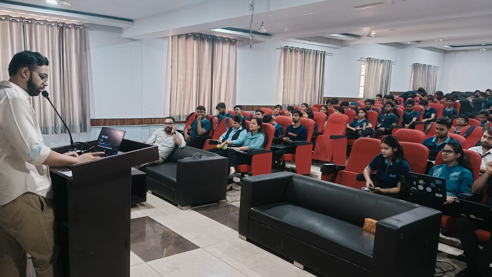
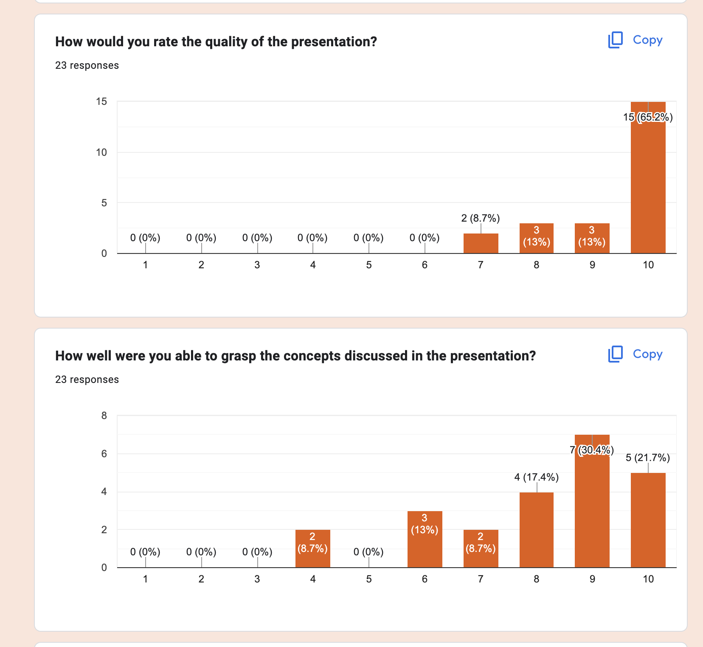

---
title: "Workshops by Vipul Gupta"
description: "Vipul Gupta (vipulgupta2048) workshops on Git, GitHub, CI, and developer education with hands-on sessions."
---

Through my workshops, I strive to not just inform but to connect, making each concept relatable and each session memorable. I still have a lot to learn, and you can find me collecting feedback from the audience after the talk. I intend to bring my unqiue brand of firestarter into each session I execute. No repeats, no boring monologue, and if I can help it - then a good story. Served on a stage near you.

---

## Book a Paid Workshop for Your Team

**Looking to upskill your engineering team on AI-powered development?**

I offer a comprehensive **[AI-Powered Development & Test Automation Workshop](/ai-workshop)** designed for engineering teams, QA professionals, and technical leadership. This half-day hands-on session covers:

- Production code generation with GitHub Copilot, Claude, and Cursor
- Self-healing test automation frameworks
- CI/CD integration with AI tools
- Adoption strategy and ROI metrics

**[View the full workshop proposal and book a session →](/ai-workshop)**

---

## Past Workshops 

## 🎓 IIMT University: GDG on Campus Meerut - #GitToGather Event

• 📝 [Post](https://www.linkedin.com/feed/update/urn:li:activity:7333078054379945984/)  
• 📊 [Slides](https://github.com/vipulgupta2048/git-intro)  
- 📸 [Linkedin Post](https://www.linkedin.com/posts/gdg-on-campus-iimt_gittogather-githubbootcamp-techskills-activity-7329389841782136832-xN8l?utm_source=share&utm_medium=member_desktop&rcm=ACoAACD76ywBmaTacRmcewhE1c2v2s8L8FVxT4k)

This hands-on workshop introduced students to the fundamentals of version control using Git and collaborative development with GitHub. Participants learned essential concepts including repository creation, branching, committing changes, and pull requests. The session combined theoretical explanations with practical exercises, enabling students to set up their first repositories and understand the workflow used by developers worldwide. Also, discussed career paths and summer programs they could participate in.

## 🌟 GitHub Constellation 2024: How Balena Releases 100's of Embedded Operating Systems with GitHub Actions in Hours, Not Weeks

• 🔗 [Event Link](https://githubconstellation.com/schedule/how-balena-releases-100s-of-embedded-operating-systems-with-github-actions-in-hours-not-weeks)  
• 🎥 [Recording](https://www.youtube.com)  
• 📊 [Slides](https://slides.com/vipulgupta2048/constellation-2024/fullscreen)  

This presentation was about how Balena is using GitHub Actions to test hundreds of OS images, specifically focusing on balenaOS and the challenges of testing embedded operating systems. The talk is about balenaOS's build, testing, and deployment pipelines using GitHub Actions.

**Feedback from the session:**

| Feedback 1 | Feedback 2 |
|:---:|:---:|
|  |  |

